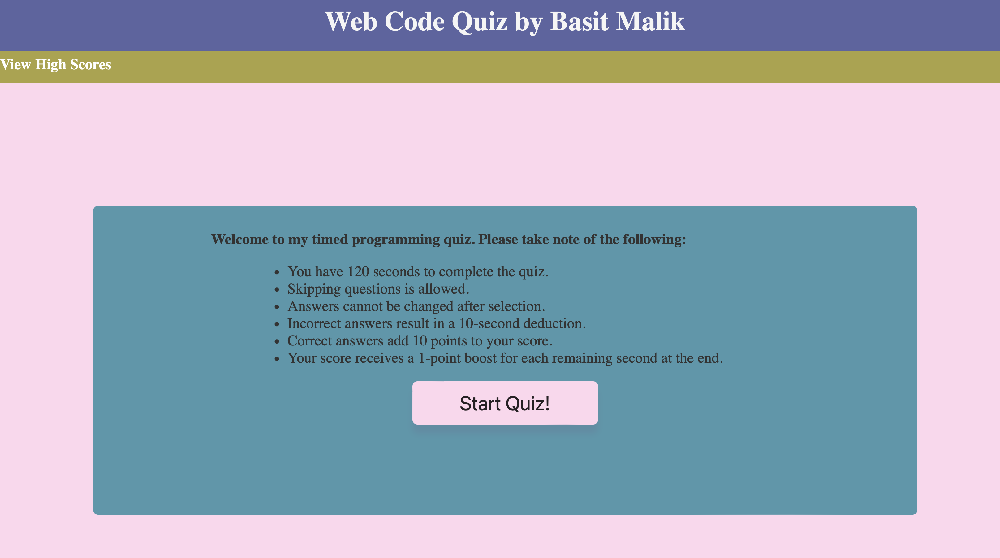
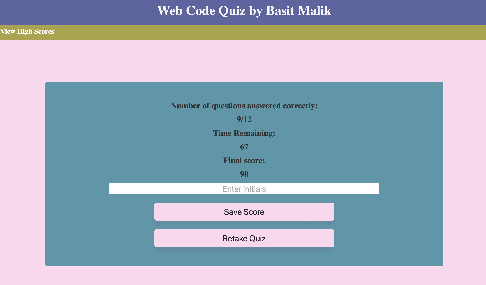
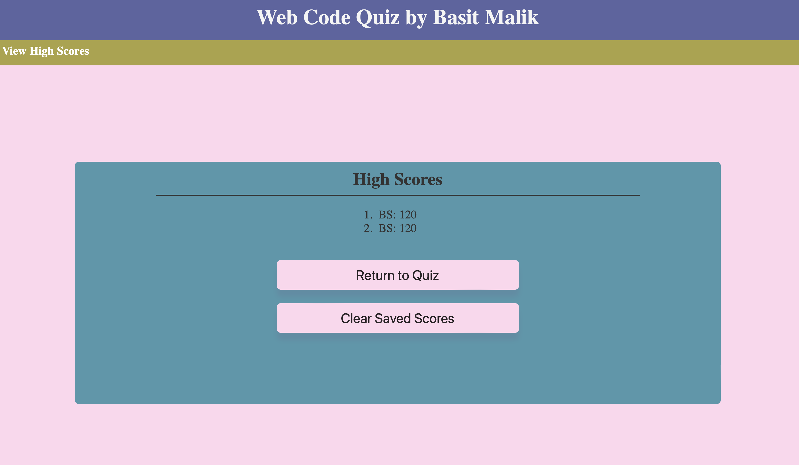

# JavaScript Quiz Application

Welcome to my timed programming quiz application. Please read the following instructions before you begin:

## Instructions

- You have 120 seconds to complete the quiz.
- You are allowed to skip questions if needed.
- Once an answer is selected, it cannot be changed.
- Providing an incorrect answer will result in a 10-second deduction.
- Each correct answer adds 10 points to your score.
- Your final score receives a 1-point boost for each remaining second at the end.

## Screenshots

*Quiz Start*

*Quiz Finish*

*Highscore*

## Getting Started

To run the quiz application locally, follow these steps:

1. Clone this repository to your local machine.
2. Open the `index.html` file in a web browser.

## Features

- Timed quiz with a countdown timer.
- Multiple-choice questions with options.
- Dynamic scoring system based on correct answers and remaining time.

## Technologies Used

- HTML
- CSS
- JavaScript

## Contributions

Contributions are welcome! If you'd like to contribute to the project, please follow these steps:

1. Fork the repository.
2. Create a new branch for your feature/bugfix.
3. Make your changes and submit a pull request.

